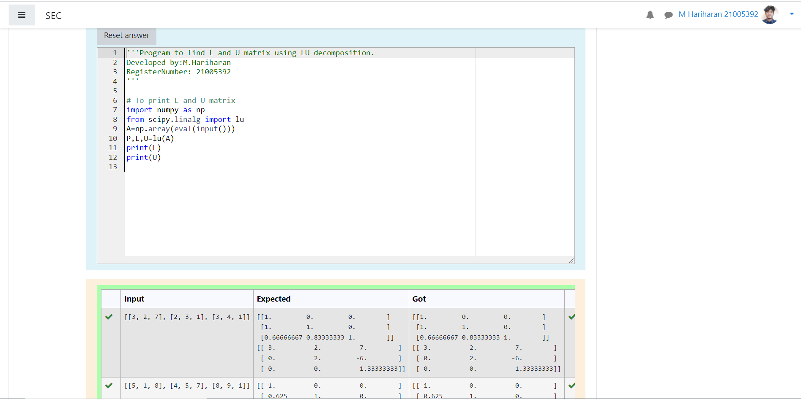
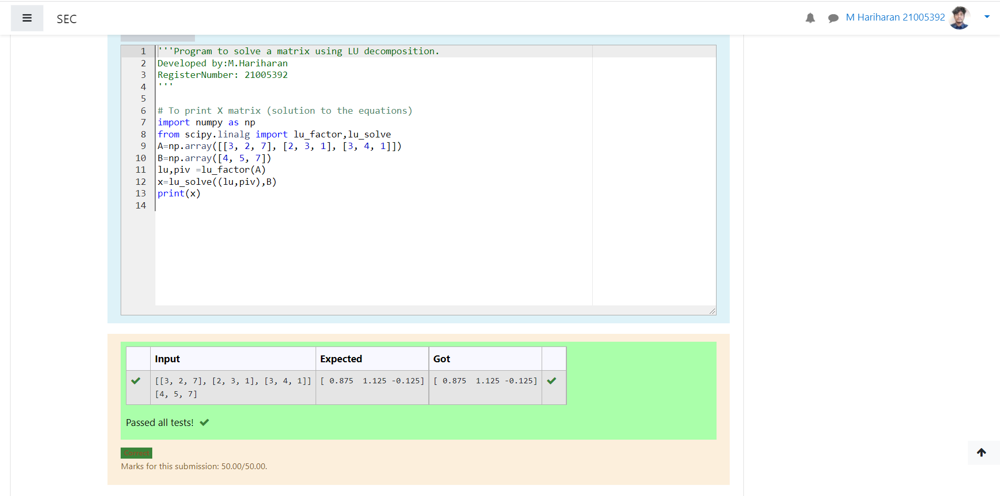

# LU Decomposition without zero on the diagonal

## AIM:
To write a program to find the LU Decomposition of a matrix.

## Equipments Required:
1. Hardware – PCs
2. Anaconda – Python 3.7 Installation / Moodle-Code Runner

## Algorithm
1. Import numpy
2. From scipy import lu
3. Get the input
4. By using the commands P,L,U=lu() and lu,piv =lu_factor() we will get the respective result
5. Print the output

## Program:
```
/*
Program to find the L and U matrix.
Developed by: M.Hariharan
RegisterNumber: 21005392
*/
```
~~~
import numpy as np
from scipy.linalg import lu
A=np.array(eval(input()))
P,L,U=lu(A)
print(L)
print(U)
~~~
```
/*
Program to solve a matrix Using LU Decomposition.
Developed by: M.Hariharan
RegisterNumber: 21005392
*/
```
~~~
import numpy as np
from scipy.linalg import lu_factor,lu_solve
A=np.array(eval(input()))
B=np.array(eval(input()))
lu,piv =lu_factor(A)
x=lu_solve((lu,piv),B)
print(x)
~~~

## Output:
Program to find the L and U matrix.

Program to solve a matrix Using LU Decomposition.



## Result:
Thus the program to find the LU Decomposition of a matrix is written and verified using python programming.

